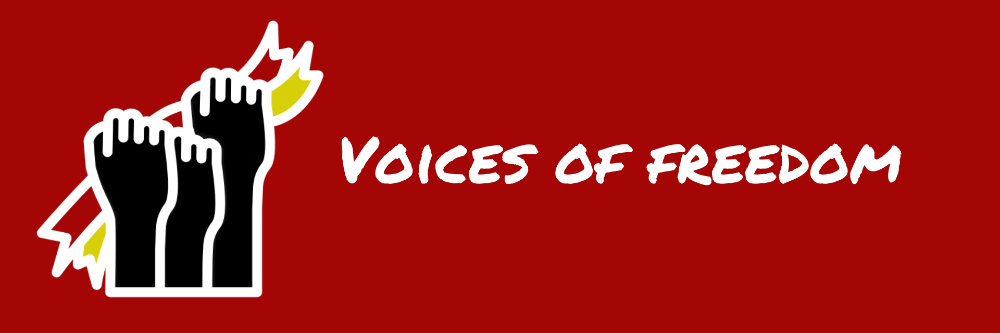
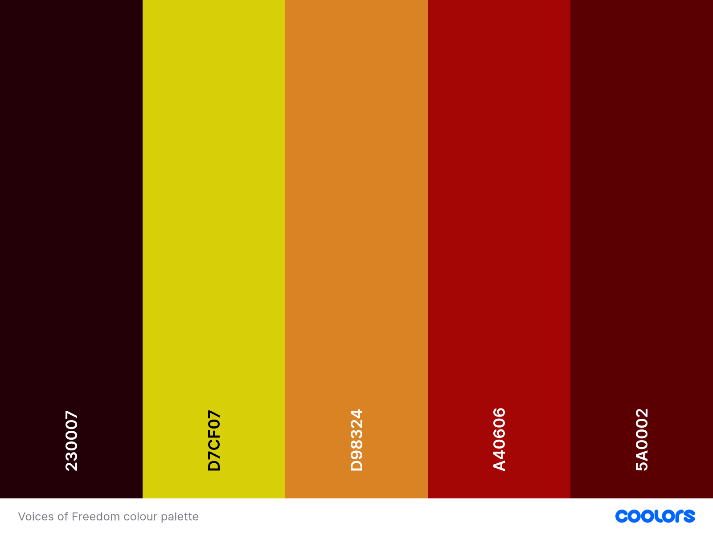

# FreedomCoders

## Voices of Freedom

**Overview**

Voices of Freedom is an educational platform developed by FreedomCoders to raise awareness during **National Slavery and Human Trafficking Prevention Month 2025.** 

With **over 50 million people** affected globally, modern slavery and human trafficking remain urgent issues. Yet many are unaware of how to recognise signs of exploitation or take action.

Our platform sheds light on this critical topic by providing engaging **learning materials**, compelling **survivor stories** that inspire hope and awareness, and **practical ways** for users to join the fight against modern slavery. 

Visitors can explore a resources hub on our **Take Action** page, featuring charities, authorities, and helplines offering support and guidance. An **informative statistics** page and an **interactive quiz** further enhance learning and encourage reflection. At Voices of Freedom, we are driven by a unified purpose: 

    "Raising Awareness, Restoring Freedom."

This is a website created for **Code Institute's *'Code to Protect'* hackathon of January 2025**, and is for educational purposes only. 

Resources and information included are from available sources online and have been actively referenced in the README.

## Showcase

A **deployed link** to the live website can be found here -  [Voices of Freedom](https://cordamir.github.io/freedom-coders/)

## Developers

**Damir**
[GitHub](https://github.com/CorDamir)

**Tarah**
[GitHub](https://github.com/tarahwaters) - [LinkedIn](https://www.linkedin.com/in/tarahwaters/)

**Cass**
[GitHub](https://github.com/CassJBeckford) - [LinkedIn](https://www.linkedin.com/in/tarahwaters/)

**Tumelo**
[GitHub](https://github.com/tumelo-maja)

**Sam**
[GitHub](https://github.com/sam2829) - [LinkedIn](https://www.linkedin.com/in/samuel-scarisbrick/)

**Evanthia**
[GitHub](https://github.com/evapalatou)

**Prajakta**
[GitHub](https://github.com/PrajaktaSarnaik)

## Product Vision

**Voices of Freedom** was created to help prevent and spread awareness of **Modern Slavery and Human Trafficking** during **National Slavery and Human Trafficking Prevention Month 2025**.

The website is a hub of educational resources that also inspires users to actively participate in the ongoing campaign.

Users can learn more about the campaign and how prevalent an issue modern slavery is by engaging with the resource links and reading the facts and survivor stories showcased around the site. There is also the option for users to test their knowledge via the interactive quiz.

## Features (MVP)

1. **Home Page** - 
    
    Key information displayed about the issue of modern slavery, what it is and how we each can get involved. A sliding carousel showcases survivor 'Freedom' stories that can be read in detail by clicking the links to external sources.

2. **Statistics Page** - 

    Global statistics, UK statistics information and guidance on how to spot signs of abuse - these are clearly displayed, alongside visuals, for users to learn more and engage with the topic thoroughly. A button link to the Take Action page is displayed below the main content to navigate users to a page where they can participate in the awareness campaign.

3. **Take Action Page** - 
    
    An interactive quiz modal is featured on this page which allows users to test their knowledge on the topic of modern slavery. 

    Users can receive instant feedback of their answers and overall score and reset the quiz to try again - 5 random questions (currently from 10 options) are selected as part of the quiz. 
    
    There is also an expandable accordion featured which gives more information on how users can get involved e.g. training courses / how to donate to relevant charities / where to sign up to newsletters.

4. **Quiz Mechanics** -

5. **About Us Page** - 

    This page showcases an image of each team member that contributed to the Voices of Freedom project and their general role. Buttons link to the team members' Github / LinkedIn pages for users to connect with the development team.

6. **Get in Contact** - 

    The 'Get in Contact' button is accessible from the navbar of every page and also from the 'Contact' link via the footer. This opens up a modal Contact form where users can enter their details to provide feedback about the website. There are also signposts to appropriate UK authorities here that guide users to report a concern of modern slavery that they may have.

    The contact form does not currently send the data anywhere, but a confirmation message is shown to the user ('Thank you for contacting us!'), if they are to click the Submit button.

## Features (post MVP)

1.

2.

3.

## **User Stories**

### Epic - Navigation

1 - As a user, a clear navigation bar is present throughout the site, so that I can navigate easily between different pages.

### Epic - Landing Page

2 - As a new user, I can instantly see what the website is about, so that I can understand the value that it may offer me.

### Epic - Contact us

3 - As a user, a contact form is available, so that I can contact the site to request further information.

4 - As a user, a clear success message is displayed on submitting the form, so that I know my message has been successful.

### Epic - Quiz

5 - As a user, 

6 - As a user, 

7 - As a user, 

8 - As a user, 

### Epic - About the team

9 - As a user, I can read about the team and why this website has been created, so that I can learn the story behind the site.

10 - As a user, I can click to visit the Github pages for the developers that created the site, so that I can find out more about them and connect should I wish.

## **Wireframes**

Wireframes were created using [Balsamiq](https://balsamiq.com/wireframes/) and used as a blueprint for development of the site layout and structure.

- [Home Page - desktop and mobile wireframes](/docs/wireframe-home.png)
- [About Page - desktop and mobile wireframes](/docs/wireframe-about.png)
- [Take Action Page - desktop and mobile wireframes](/docs/wireframe-take-action.png)
- [Quiz Page - desktop and mobile wireframes](/docs/wireframe-quiz.png)*
- [Contact Page - desktop and mobile wireframes](/docs/wireframe-contact.png)

These are the initial wireframes but they have evolved as the project has progressed.

*Quiz page - it was decided that instead of a separate page for the quiz/zes, we would add them to the bottom of the info pages - e.g. Facts / Spot the Signs.

## **Design**

### **Logo**

The logo was created using an icon by Ainnul Rofiq via [Flaticon](https://www.flaticon.com/authors/ainnul-rofiq)

### **Typography**

**FontJoy** was used to test aesthetic font pairings once the *Permanent Marker* font was chosen to be most similar to the icon style.

- *Permanent Marker* - logo font
- *Maven Pro* - Headings
- *Open Sans* - Body
- *Sans-serif* - as general backup font

### **Colour Scheme**

A colour scheme was developed using **Coloors** (see below for reference).
In light of the serious tone we wanted to convey on this website given the theme, we chose red hues for a sense of urgency and call-to-action.

**Colour scheme used as inspiration for styling**:

The colour scheme was tested on a mock website as part of the planning process via [Realtime Colors](https://www.realtimecolors.com/?colors=ffffff-230007-A40606-D98324-D7CF07&fonts=Inter-Inter).

## Tools and Technologies Used:

- **HTML5**
- **CSS**
- **Bootstrap**
- **JavaScript**

- [GitHub and Github Pages](https://github.com/) - used to securely store the code and to host and deploy the live project
- [GitPod](https://www.gitpod.io/) - used as a cloud-based IDE for development
- [Chrome Developer Tools](https://developer.chrome.com/docs/devtools/) - used for testing and troublshooting code, along with Lighthouse auditing
- [Balsamiq](https://balsamiq.com/wireframes/) - used to create wireframes during project planning
- [redketchup.io](https://redketchup.io/) - used for resizing and converting image files to webp format
- [Canva](https://www.canva.com/) - used to create logo, hero images
- [Coolors](https://coolors.co/) - used to generate a color palette for the website design
- [TinyPNG](https://tinypng.com/) - converting and compressing images
- [FontJoy](https://fontjoy.com/) - used to generate visually appealing font pairings for  the website
- [Realtime Colors](https://www.realtimecolors.com/?colors=ffffff-230007-A40606-D98324-D7CF07&fonts=Inter-Inter) - used to test colour scheme on a mock website
- [AmIResponsive?](https://ui.dev/amiresponsive?url=https://tarahwaters.github.io/milestone-project2/) - used to create a mockup of the website

## Credits
- [Flaticon logo - 'independency' icon](https://www.flaticon.com/authors/ainnul-rofiq) by Ainnul Rofiq accessible through Flaticon, free for usage with credit reference

## References 

Victim's stories referenced on the website:
 
- [Unseen.org - Katherine's story](https://www.unseenuk.org/case-study/katherines-story/)
- [Unseen.org - Wayne’s story](https://www.unseenuk.org/case-study/waynes-story/)
- [Unseen.org - Paula’s story](https://www.unseenuk.org/case-study/paulas-story/)
- [Unseen.org - Franks story](https://www.unseenuk.org/case-study/franks-story/)
- [Unseen.org - Aubree Alles story](https://polarisproject.org/survivor-story-aubree-alles/)
- [PolarisProject.org - Three brother - debt bondage story](https://www.ijm.org/news/three-brothers-freed-from-slavery-over-fathers-debt)
- [WorldsChildrensPrize.org - Child slavery story](https://worldschildrensprize.org/slavechildrensstories)
-[AntiSlavery.org - Descend-based slavery Saidou story](https://www.antislavery.org/impact/stories/saidou/)
- [SnowDropProject.co.uk - Other stories referenced](https://www.snowdropproject.co.uk/survivor-stories)

Facts and figures quoted are from the following online references:

- Source: **United Nations Office on Drugs and Crime (UNODC)**. [ [Link](https://www.unodc.org/unodc/en/human-trafficking/what-is-human-trafficking.html) ]
- Source: **International Labour Organization (ILO)**. [ [Link](https://www.ilo.org/global/topics/forced-labour/lang--en/index.htm) ]
- Source: **Anti-Slavery International - Bonded Labour**. [  [Link](https://www.antislavery.org/slavery-today/bonded-labour/) ]
- Source: **United Nations Human Rights Office (OHCHR) - Slavery in Law**. [ [Link](https://www.ohchr.org/en/issues/slavery/srslavery/pages/slaveryinlaw.aspx) ]
- Source: **United Nations Children's Fund (UNICEF) - Child Labour**. [ [Link](https://www.unicef.org/protection/child-labour) ]

Apart from the direct references / links to other sources showcased on the deployed site, the following references were used for researching the topic.

- **Modern Slavery Helpline** - reporting signs of abuse. [ [Link](https://www.modernslaveryhelpline.org/) ]
- **Unseen** - helpline hero campaign. [ [Link](https://www.unseenuk.org/get-involved/helpline-hero/) ]
- **StopTheTraffik** - spot the signs of modern slavery quiz. [ [Link](https://stopthetraffik.org/can-you-spotthesigns/) ]
- **UK Gov - National Crime Agency** - Modern Slavery and Human Trafficking information and spotting the signs of modern slavery. [ [Link](https://www.nationalcrimeagency.gov.uk/what-we-do/crime-threats/modern-slavery-and-human-trafficking) ]

Images were taken from different resources:

- **National Crime Agency.** [Link](https://www.nationalcrimeagency.gov.uk/threats/nsa-modern-slavery-and-human-trafficking-2024)

- **Google Images**

## Agile Development Process

**Agile Methodology**

Our project uses Agile methodology, a framework that enables us to respond to the unpredictability of building software through incremental, iterative work cadences, known as sprints. This approach fosters adaptability and encourages a rapid and flexible response to change, which is vital in the dynamic environment of software development.

At the start of each sprint, our team engages in sprint planning to set the direction for our upcoming work, involving prioritization of the product backlog to address the most critical tasks first, defining clear sprint goals aligned with project milestones, and assigning tasks based on expertise and workload. Throughout development, we navigate trade-offs between scope, quality, time, and resources to maintain a balance between delivering high-quality work efficiently and managing priorities. Adopting Agile methodologies allows us to remain adaptable and focused, ensuring we meet user needs while striving for excellence.

**Collaboration Tools** 

The team used Slack where we regularly hosted meetings and to message in for quick collaboration purposes and Github projects to track ideas, User Stories, Bugs and Time plan.

The Team used Slack team channel to ensure everyone stayed updated on project progress and discussions.

The Team used Google Documents to post ideas, wireframes and to store any information gathered for the project. [GoogleDoc](https://docs.google.com/document/d/1YvAS-RXjQaYDmuNbehmJxcsoWKRscpwTQT9ZDY2BMoU/edit?tab=t.0#heading=h.lvi0usp9ejgi)

## Deployment

### Deployment to GitHub Pages

This project was deployed on GitHub pages using the following steps:

- From the project's repository, go to the settings tab.

- From the left-hand-menu, select the pages tab.

- Select the Main branch from under the Source section dropdown and click Save.

- After a few minutes, a message will display to indicate a successful deployment and provide a Live link.

### Local Deployment

**Version Control**

For version control the following steps were made:

- If any changes were made to the Gitpod or VS Code project.

- First files were made ready for commit with command - 'git add filename or git add .' second option to add all files.

- To commit the changes using the following command - git commit -m "This is my commit" Note the brief description at the end of the command to make you aware of what changes have occurred.

- To then move the changes to GitHub, use the following command - git push your branch name.

- Create a pull request in GitHub which another member can then approve.

- Update local workspace then with command git pull origin main.

## Testing

### Code Validation

#### HTML

We have used the recommended [HTML W3C Validator](https://validator.w3.org) to validate our HTML files.

| Page | W3C URL | Screenshot |
| --- | --- | --- |
|  Homepage | TBC | TBC |
| About Us Page | TBC | TBC |
| Statistics Page | TBC | TBC |
| Take action Page | TBC | TBC |
| Error 404 Page | TBC | TBC |

#### CSS

We have used the recommended [CSS Jigsaw Validator](https://jigsaw.w3.org/css-validator) to validate our CSS files.

| File | Jigsaw URL | Screenshot |
| --- | --- | --- |
| style.css | TBC | TBC |
| quizz.css | TBC | TBC |

#### JAVASCRIPT

We have used the recommended [JShint Validator](https://jshint.com) to validate our JS file.

| File | Screenshot | Notes |
| --- | --- | --- |
| modal-mechanics.js | to follow | to follow |
| quiz-data.js | to follow | to follow |
| quizz-mechannics.js | to follow | to follow |