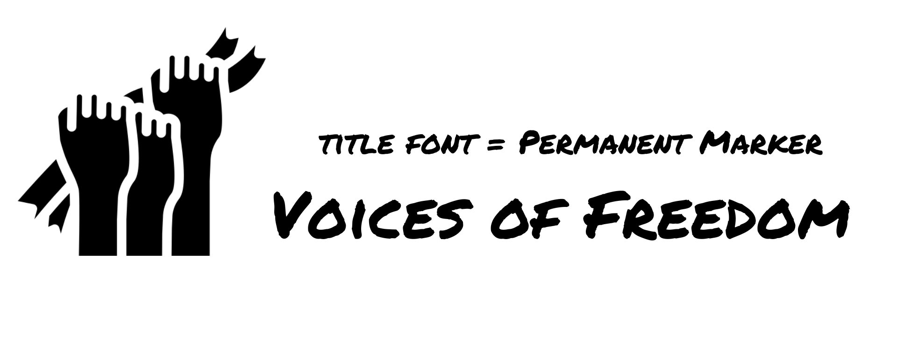
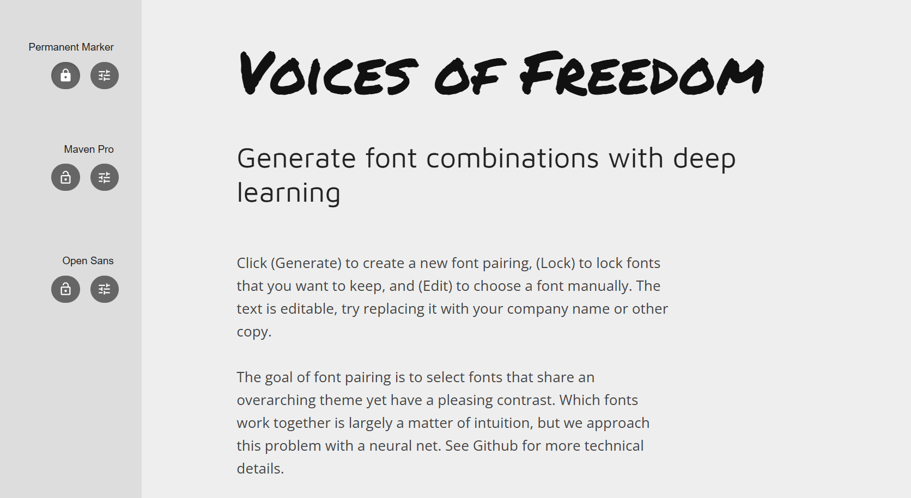

# FreedomCoders

## Voices of Freedom

**Overview**

*"Raising Awareness, Restoring Freedom"* 

Voices of Freedom aims to highlight the important and prevalent issue of Modern Slavery and Human Trafficking during **National Slavery and Human Trafficking Prevention Month 2025**.

This is a website created for Code Institute's *'Code to Protect'* hackathon of January 2025, and is for educational purposes only. 

Resources and information included are from available sources online and have been actively referenced in the README.

## Showcase

A **deployed link** to the live website can be found here -  [Voices of Freedom](https://cordamir.github.io/freedom-coders/)

## Developers

**Damir**
[GitHub](https://github.com/CorDamir)

**Tarah**
[GitHub](https://github.com/tarahwaters) - [LinkedIn](https://www.linkedin.com/in/tarahwaters/)

**Cass**
[GitHub](https://github.com/CassJBeckford) - [LinkedIn](https://www.linkedin.com/in/tarahwaters/)

**Tumelo**
[GitHub](https://github.com/tumelo-maja)

**Sam**
[GitHub](https://github.com/sam2829)

**Evanthia**
[GitHub](https://github.com/evapalatou)

**Prajakta**
[GitHub](https://github.com/PrajaktaSarnaik)

## Product Vision

**Voices of Freedom** was created to help prevent and spread awareness of **Modern Slavery and Human Trafficking** during **National Slavery and Human Trafficking Prevention Month 2025**.

The website is a hub of educational resources that also inspires users to actively participate in the ongoing campaign.

Users can learn more about the campaign and how prevalent an issue modern slavery is by engaging with the resource links and reading the facts and survivor stories showcased around the site. There is also the option for users to test their knowledge via the interactive quiz.

## Features (MVP)

1.

2.

3.

## Features (post MVP)

1.

2.

3.

## **User Stories**

### Epic - Navigation

1 - As a user, a clear navigation bar is present throughout the site, so that I can navigate easily between different pages.

### Epic - Landing Page

2 - As a new user, I can instantly see what the website is about, so that I can understand the value that it may offer me.

### Epic - Contact us

3 - As a user, a contact form is available, so that I can contact the site to request further information.

4 - As a user, a clear success message is displayed on submitting the form, so that I know my message has been successful.

### Epic - Quiz

5 - As a user, 

6 - As a user, 

7 - As a user, 

8 - As a user, 

### Epic - About the team

9 - As a user, I can read about the team and why this website has been created, so that I can learn the story behind the site.

10 - As a user, I can click to visit the Github pages for the developers that created the site, so that I can find out more about them and connect should I wish.

## **Wireframes**

Wireframes were created using [Balsamiq](https://balsamiq.com/wireframes/) and used as a blueprint for development of the site layout and structure.

- [Home Page - desktop and mobile wireframes](/docs/wireframe-home.png)
- [About Page - desktop and mobile wireframes](/docs/wireframe-about.png)
- [Take Action Page - desktop and mobile wireframes](/docs/wireframe-take-action.png)
- [Quiz Page - desktop and mobile wireframes](/docs/wireframe-quiz.png)*
- [Contact Page - desktop and mobile wireframes](/docs/wireframe-contact.png)

These are the initial wireframes but they have evolved as the project has progressed.

*Quiz page - it was decided that instead of a separate page for the quiz/zes, we would add them to the bottom of the info pages - e.g. Facts / Spot the Signs.

## **Design**

### **Logo**

The logo was created using an icon by Ainnul Rofiq via [Flaticon](https://www.flaticon.com/authors/ainnul-rofiq)

### **Typography**

**FontJoy** was used to test aesthetic font pairings once the *Permanent Marker* font was chosen to be most similar to the icon style.

- *Permanent Marker* - logo font
- *Maven Pro* - Headings
- *Open Sans* - Body
- *Sans-serif* - as general backup font

### **Colour Scheme**

A colour scheme was developed using **Coloors** (see below for reference), which aligned with the main icons and purple theme. This was used as a basis for background colour choices (though not all were utilised), with an emphasis on consistency with the icon theme and neutrality.

**Colour scheme used as inspiration for styling**:

## Tools and Technologies Used:

- **HTML5**
- **CSS**
- **Bootstrap**
- **JavaScript**

- [GitHub and Github Pages](https://github.com/) - used to securely store the code and to host and deploy the live project
- [GitPod](https://www.gitpod.io/) - used as a cloud-based IDE for development
- [Chrome Developer Tools](https://developer.chrome.com/docs/devtools/) - used for testing and troublshooting code, along with Lighthouse auditing
- [Balsamiq](https://balsamiq.com/wireframes/) - used to create wireframes during project planning
- [redketchup.io](https://redketchup.io/) - used for resizing and converting image files to webp format
- [Canva](https://www.canva.com/) - used to create logo, hero images
- [Coolors](https://coolors.co/) - used to generate a color palette for the website design
- [TinyPNG](https://tinypng.com/) - converting and compressing images
- [FontJoy](https://fontjoy.com/) - used to generate visually appealing font pairings for  the website
- [AmIResponsive?](https://ui.dev/amiresponsive?url=https://tarahwaters.github.io/milestone-project2/) - used to create a mockup of the website

## Credits
- [Flaticon logo - 'independency' icon](https://www.flaticon.com/authors/ainnul-rofiq) by Ainnul Rofiq accessible through Flaticon, free for usage with credit reference

## References

- Source: **Reference / Description here**. [Link - #]
- Source: **Reference / Description here**. [Link - #]
- Source: **Reference / Description here**. [Link - #]
- Source: **Reference / Description here**. [Link - #]
- Source: **Reference / Description here**. [Link - #]